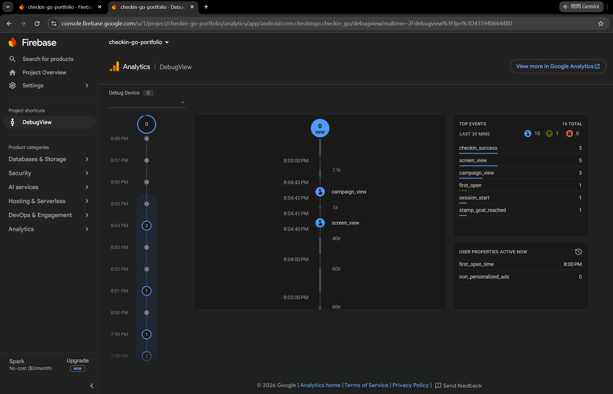

# 打卡趣 CheckinGo

台灣旅遊景點推廣的行銷平台作品集專案：虛構品牌「打卡趣」舉辦「島嶼打卡季」活動——瀏覽精選景點、到現場 GPS 打卡集章、換取獎勵。

一個 repo 同時展示 **React 行銷頁 + Flutter App + REST API 整合**，對齊「React/Flutter 行銷頁面開發」職缺的技能要求（WebView 嵌入、狀態管理、GPS 地圖、Firebase 成效追蹤、SEO 與效能）。

> 本專案為個人作品集用途，品牌與活動皆為虛構；景點名稱與座標為公開資訊，僅供 demo。

## 架構

```
checkin-go/
├─ api/   FastAPI — 景點 / 活動 REST API（唯讀種子資料）
├─ web/   Next.js — 「島嶼打卡季」行銷 Landing Page（SSG+ISR、Zustand、framer-motion、SEO）
└─ app/   Flutter — 品牌 App（原生活動頁 + WebView 嵌入 web、GPS 打卡地圖）※ phase 2 起
```

## Roadmap（OpenSpec changes）

| # | Change | 內容 | 狀態 |
|---|--------|------|------|
| 1 | `add-mvp-web-api` | monorepo 骨架 + FastAPI + Next.js 活動頁（可部署展示） | 實作完成（待部署） |
| 2 | `add-flutter-shell` | Flutter App：原生首頁 + WebView 嵌入活動頁 | 實作完成 |
| 3 | `add-gps-checkin` | 地圖 + GPS 打卡集章（geolocator） | 實作完成 |
| 4 | `add-firebase-analytics` | Firebase Analytics 漏斗 + Remote Config A/B | 實作完成 |
| 5 | `add-testing-perf` | Jest/RTL + Flutter 測試、效能優化、Android release build | 實作完成 |

規格見 [openspec/changes/](openspec/changes/)。

## 開發

### api（FastAPI）

```powershell
cd api
py -3.11 -m venv .venv
.\.venv\Scripts\python.exe -m pip install -r requirements.txt
.\.venv\Scripts\python.exe -m uvicorn main:app --port 8000
```

端點：`GET /api/spots`（`?city=` 篩選）、`GET /api/spots/{id}`、`GET /api/campaigns/current`。
跨域來源用 `ALLOWED_ORIGINS` 環境變數控制（逗號分隔，預設 `http://localhost:3000`）。

### web（Next.js 16 / React 19 / Tailwind v4）

```powershell
cd web
npm install
npm run dev     # 開發（http://localhost:3000）
npm run build   # SSG + ISR（revalidate 3600s）；API 沒開也能建置（fallback 靜態資料）
npm run start   # 服務 production build
npm test        # Jest + React Testing Library（14 項，離線可跑，不依賴 API/Web server）
```

環境變數見 `web/.env.example`（`API_BASE_URL`、`SITE_URL`）。


**CJK 字型自架子集化**：`layout.tsx` 用 `next/font/local` 載入 `src/app/fonts/noto-sans-tc-*.woff2`
（5 個字重，各 ~108KB），取代 `next/font/google`。Google Fonts 對 CJK 用 unicode-range 分片下發，
但本站文案零散分佈在整個 CJK 統一表意文字區段，實測仍要下載 22 個檔（~1.6MB）；改用
`scripts/subset-noto-sans-tc.py`（`fonttools`）只打包網站實際用到的 623 個字元，5 個字重合計
~540KB，且不必再連 `fonts.gstatic.com`。文案新增字元時重跑：

```powershell
cd web
pip install fonttools brotli
python scripts/subset-noto-sans-tc.py
```

### app（Flutter 3.44 / Riverpod 3 / webview_flutter）

```powershell
cd app
flutter pub get
flutter test        # widget tests（Riverpod override 注入假資料，19 項）
flutter build apk --debug
flutter run         # 預設打 Android emulator 的 10.0.2.2（host loopback）
# 實體手機改打電腦區網 IP：
# flutter run --dart-define=API_BASE_URL=http://192.168.x.x:8000 --dart-define=WEB_URL=http://192.168.x.x:3000
```

**Release build**：`android/key.properties`（不進 repo）設定簽名，`build.gradle.kts` 讀不到時自動
fallback debug 簽名並印警告（不會直接建置失敗）。

```powershell
cd app
flutter build appbundle --release   # Play Console 上架格式
flutter build apk --release         # 直接安裝測試用
```

> ⚠️ 本機中文路徑（`C:\程式\...`）會讓 Dart AOT snapshotter 讀 `.dill` 檔失敗（release/profile
> 專屬問題，debug 是 JIT 不受影響）。Windows junction 繞不過去（工具鏈會解回真實路徑），要把
> `app/` **完整複製**到 ASCII 路徑（例如 `C:\dev\checkin-go-app-build\`）再從那邊建置。

已用 `apksigner verify` 確認簽名憑證正確（`CN=CheckinGo Portfolio, ...`，非 debug 憑證），並在
emulator 安裝實測：首頁正確吃到真 API 資料、地圖頁 marker/進度列正常。WebView 頁因 release
manifest 沒有 `usesCleartextTraffic` 例外（該例外刻意只設在 debug manifest）會擋下本機 HTTP dev
server，正確顯示「載入失敗＋重新載入」畫面而非崩潰——這是設計行為，正式部署後 `WEB_URL` 會指向
HTTPS 網址，不受影響。

| 原生首頁（吃 marketing-api） | 地圖打卡（12 景點 marker） | GPS 打卡 bottom sheet | WebView 嵌入 React 活動頁 |
|---|---|---|---|
|  |  |  |  |

- 底部導覽（首頁／地圖打卡／活動網頁）+ IndexedStack 保留各頁狀態；系統返回鍵優先走 WebView 歷史（PopScope）
- GPS 打卡：flutter_map（OSM tiles）+ geolocator 即時定位，距離 ≤ 景點打卡半徑才可打卡；集章存 shared_preferences，App 重啟後保留（emulator 以 `adb emu geo fix` 實測：象山親山步道 0 公尺打卡成功、清水斷崖 92.1 公里鎖定、force-stop 重啟後進度 1/12 不變）
- 環境備註：Gradle 需 JDK 17–21（本機用 Temurin 21，`flutter config --jdk-dir`）；中文專案路徑需 `android.overridePathCheck=true`
- iOS：程式碼與 `ios/` 目標已就緒，但建置/上架需要 macOS + Xcode（Apple 簽章限制）。上架流程：Apple Developer 帳號 → Xcode archive → App Store Connect → TestFlight → 審核上架；Android 對應流程於 phase 5 走完（release AAB + Play Console）

### Firebase（Analytics + Remote Config）

專案：[checkin-go-portfolio](https://console.firebase.google.com/project/checkin-go-portfolio)（Spark 免費方案，Android app 已註冊）。

```powershell
# 初次設定（已完成，記錄供重現）
npm install -g firebase-tools
firebase login
dart pub global activate flutterfire_cli
cd app
flutterfire configure --project=checkin-go-portfolio --platforms=android

# 開發時看即時事件（免等 Console 主報表的數小時延遲）
adb shell setprop debug.firebase.analytics.app com.checkingo.checkin_go
# 開 https://console.firebase.google.com/project/checkin-go-portfolio/analytics/debugview
```

- **行銷漏斗事件**：`campaign_view`（首頁載入）、`checkin_success`（GPS 打卡成功，帶 spot_id/city）、
  `stamp_goal_reached`（集滿 6 枚，僅觸發一次）。`AnalyticsService` 抽象層讓 `flutter test` 用
  `NoopAnalyticsService`，不碰真實 SDK 也不會因平台通道報錯。
- **Remote Config A/B**：`hero_slogan_variant`（`control` / `variant_b`）決定首頁 Hero 標語，
  fetch 失敗自動退回 `control`；Console 改值後下次啟動即生效（debug 模式 fetch 間隔設 0）。

| DebugView 即時漏斗事件 | Remote Config A/B（variant_b） |
|---|---|
|  |  |

DebugView 實測：`campaign_view` ×3（對應多次啟動）、`checkin_success` ×5、`stamp_goal_reached` ×1——
剛好在集滿第 6 枚那次觸發，之後繼續打卡不再重複，與規格場景吻合。

### 品質驗證（2026-07 基準）

- Lighthouse：**SEO 100**、Best Practices 100、Accessibility 96、**Performance 80**
  （字型自架子集化後由 56 提升；行動模擬節流下 simulated LCP 5.5s，但瀏覽器 observed LCP 僅
  282ms——Lighthouse 節流模型對自架 webfont 關鍵路徑偏悲觀，是已知現象，非真實使用者體感）
- 響應式：375px 無水平捲動（CDP 實測）；`prefers-reduced-motion` 完全停用動畫（CDP 實測）
- 收藏（Zustand persist）：收藏 → 重新整理 → 狀態保留（CDP 實測）
- 進場/滾動動畫為純 CSS（keyframes + scroll-driven animations），首屏不依賴 JS 即可見；
  framer-motion 用於收藏按鈕微互動
- 自動化測試：Web（Jest + RTL）14 項、Flutter 19 項，皆離線可重跑，涵蓋倒數計時、收藏、
  行銷漏斗事件觸發時機、Remote Config fallback、地圖頁五種狀態

## 環境需求

- Node.js 24+、Python 3.11+
- Flutter SDK（phase 2 起需要）
