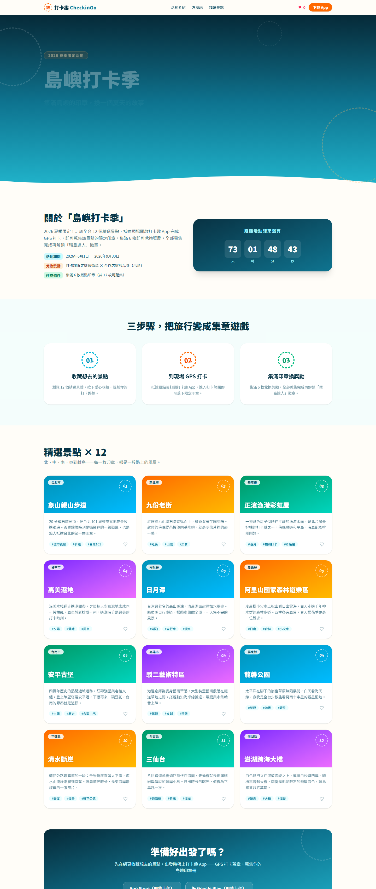
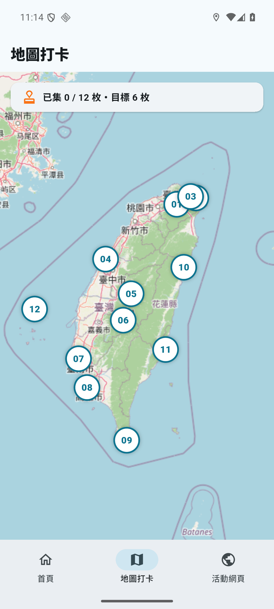
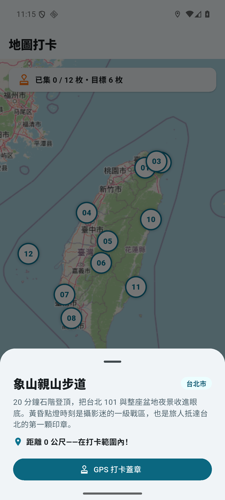

# 打卡趣 CheckinGo

台灣旅遊景點推廣的行銷平台作品集專案：虛構品牌「打卡趣」舉辦「島嶼打卡季」活動——瀏覽精選景點、到現場 GPS 打卡集章、換取獎勵。

一個 repo 同時展示 **React 行銷頁 + Flutter App + REST API 整合**，對齊「React/Flutter 行銷頁面開發」職缺的技能要求（WebView 嵌入、狀態管理、GPS 地圖、Firebase 成效追蹤、SEO 與效能）。

> 本專案為個人作品集用途，品牌與活動皆為虛構；景點名稱與座標為公開資訊，僅供 demo。

## 架構

```
checkin-go/
├─ api/   FastAPI — 景點 / 活動 REST API（唯讀種子資料）
├─ web/   Next.js — 「島嶼打卡季」行銷 Landing Page（SSG+ISR、Zustand、framer-motion、SEO）
└─ app/   Flutter — 品牌 App（原生活動頁 + WebView 嵌入 web、GPS 打卡地圖）※ phase 2 起
```

## Roadmap（OpenSpec changes）

| # | Change | 內容 | 狀態 |
|---|--------|------|------|
| 1 | `add-mvp-web-api` | monorepo 骨架 + FastAPI + Next.js 活動頁（可部署展示） | 實作完成（待部署） |
| 2 | `add-flutter-shell` | Flutter App：原生首頁 + WebView 嵌入活動頁 | 實作完成 |
| 3 | `add-gps-checkin` | 地圖 + GPS 打卡集章（geolocator） | 實作完成 |
| 4 | `add-firebase-analytics` | Firebase Analytics 漏斗 + Remote Config A/B | 未開始 |
| 5 | `add-testing-perf` | Jest/RTL + Flutter 測試、效能優化、Android release build | 未開始 |

規格見 [openspec/changes/](openspec/changes/)。

## 開發

### api（FastAPI）

```powershell
cd api
py -3.11 -m venv .venv
.\.venv\Scripts\python.exe -m pip install -r requirements.txt
.\.venv\Scripts\python.exe -m uvicorn main:app --port 8000
```

端點：`GET /api/spots`（`?city=` 篩選）、`GET /api/spots/{id}`、`GET /api/campaigns/current`。
跨域來源用 `ALLOWED_ORIGINS` 環境變數控制（逗號分隔，預設 `http://localhost:3000`）。

### web（Next.js 16 / React 19 / Tailwind v4）

```powershell
cd web
npm install
npm run dev     # 開發（http://localhost:3000）
npm run build   # SSG + ISR（revalidate 3600s）；API 沒開也能建置（fallback 靜態資料）
npm run start   # 服務 production build
```

環境變數見 `web/.env.example`（`API_BASE_URL`、`SITE_URL`）。



### app（Flutter 3.44 / Riverpod 3 / webview_flutter）

```powershell
cd app
flutter pub get
flutter test        # widget tests（Riverpod override 注入假資料）
flutter build apk --debug
flutter run         # 預設打 Android emulator 的 10.0.2.2（host loopback）
# 實體手機改打電腦區網 IP：
# flutter run --dart-define=API_BASE_URL=http://192.168.x.x:8000 --dart-define=WEB_URL=http://192.168.x.x:3000
```

| 原生首頁（吃 marketing-api） | 地圖打卡（12 景點 marker） | GPS 打卡 bottom sheet | WebView 嵌入 React 活動頁 |
|---|---|---|---|
|  |  |  |  |

- 底部導覽（首頁／地圖打卡／活動網頁）+ IndexedStack 保留各頁狀態；系統返回鍵優先走 WebView 歷史（PopScope）
- GPS 打卡：flutter_map（OSM tiles）+ geolocator 即時定位，距離 ≤ 景點打卡半徑才可打卡；集章存 shared_preferences，App 重啟後保留（emulator 以 `adb emu geo fix` 實測：象山親山步道 0 公尺打卡成功、清水斷崖 92.1 公里鎖定、force-stop 重啟後進度 1/12 不變）
- 環境備註：Gradle 需 JDK 17–21（本機用 Temurin 21，`flutter config --jdk-dir`）；中文專案路徑需 `android.overridePathCheck=true`
- iOS：程式碼與 `ios/` 目標已就緒，但建置/上架需要 macOS + Xcode（Apple 簽章限制）。上架流程：Apple Developer 帳號 → Xcode archive → App Store Connect → TestFlight → 審核上架；Android 對應流程於 phase 5 走完（release AAB + Play Console）

### 品質驗證（2026-07 基準）

- Lighthouse：**SEO 100**、Best Practices 100、Accessibility 96、Performance 56（行動模擬基準，
  主因 CJK 字型流量，為 phase 5 效能 change 的優化標的；本機 observed FCP 359ms）
- 響應式：375px 無水平捲動（CDP 實測）；`prefers-reduced-motion` 完全停用動畫（CDP 實測）
- 收藏（Zustand persist）：收藏 → 重新整理 → 狀態保留（CDP 實測）
- 進場/滾動動畫為純 CSS（keyframes + scroll-driven animations），首屏不依賴 JS 即可見；
  framer-motion 用於收藏按鈕微互動

## 環境需求

- Node.js 24+、Python 3.11+
- Flutter SDK（phase 2 起需要）
